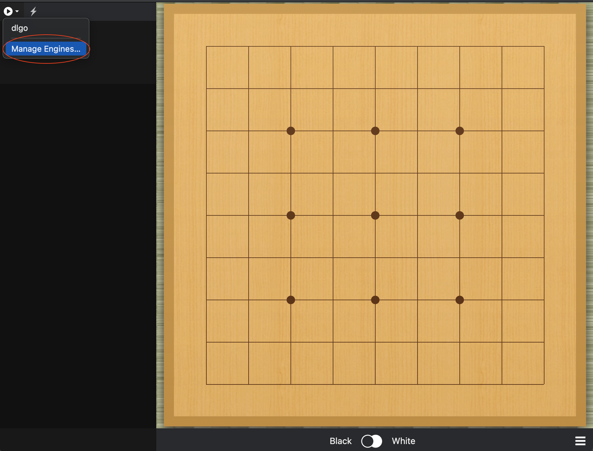
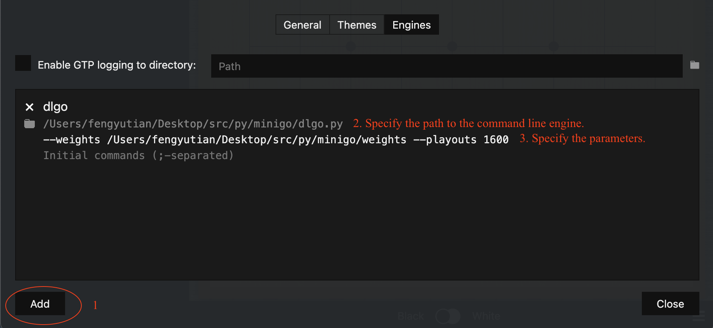
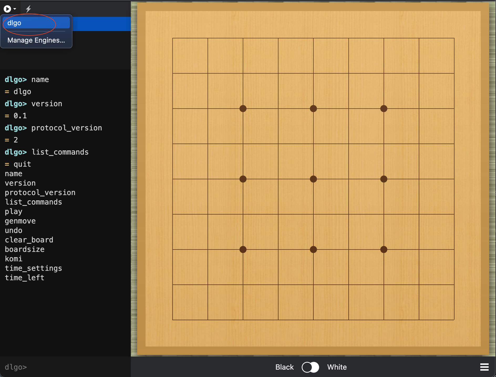
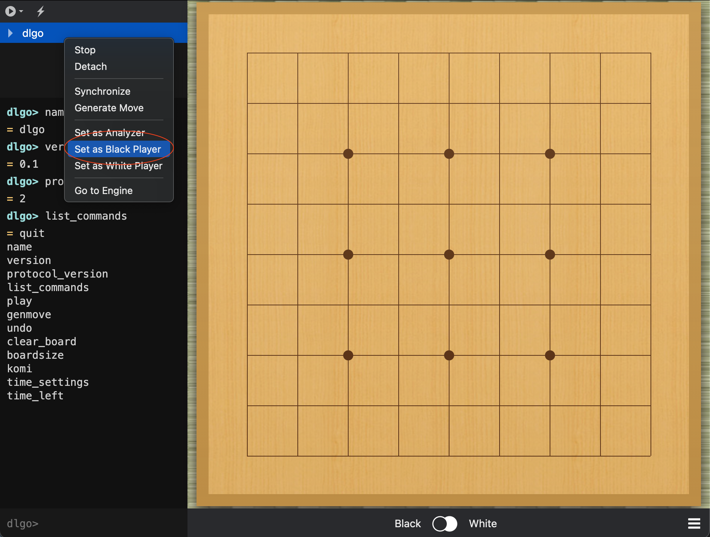

# Learning to Play Go
This repository contains the code of our CSC2515 research project.

In the project, we implement an agent that learns to play Go on 9*9 board through behaviour cloning from human knowledge and then refined with self-play. Our agent convincingly beats all baselines including several famous Go programs. 

Table of Contents
=================
  * [Install Dependancy](#install-dependancy)
  * [Prepare Data](#prepare-data)
  * [Training](#training)
  * [Run Engine on Command Line](#run-engine-on-command-line)
  * [Run Engine on Sabaki](#run-engine-on-sabaki)

## Install Dependancy
You need to install following packages in order to run the code:
- [PyTorch>=1.3.1](https://pytorch.org/)
- [NumPy](https://numpy.org/)
- [Matplotlib](https://matplotlib.org/)

## Prepare Data
Unzip the sgf data. 
``` python
unzip -q sgf.zip
```

## Training
``` python
python train_refactor.py --steps=20000
```

Several parameters can be specified:

| Parameter        | Default |                                           |
| ---------------- | ------- | ----------------------------------------- |
| data_dir      | "sgf"   | Path to the data directory.               |
| steps         | 400000  | Training steps.                           |
| verbose_step  | 1000    | Print verbose.                            |
| batch_size    | 2048    | Batch size. Recommend to be at least 128. |
| learning_rate | 1e-3    | Learning rate.                            |

## Run Engine on Command Line

We can start our pre-trained engine by:

```bash
chmod 777 dlgo.py
./dlgo.py --weights weights-name --playouts 1600 --resign-threshold 0.25
```

Several parameters can be specified:

| Parameter          | Default |                                                              |
| ------------------ | ------- | ------------------------------------------------------------ |
| weights          |         | Path to the pre-trained model.                               |
| playouts         | 400     | MCTS playouts,                                               |
| resign-threshold | 0.1     | If the possibility of win is smaller than the specified value, then resign. |


## Run Engine on Sabaki

[Sabaki](https://github.com/SabakiHQ/Sabaki) is an elegant Go board and SGF editor. Go engines can be added to Sabaki to play offline. Sabaki then acts as a graphical UI for any Go software that supports [GTP (Go Text Protocol)](https://www.lysator.liu.se/~gunnar/gtp/).

Step1: open manage engine. 



Step 2, add new engine. 



Step 3, load the engine. 



