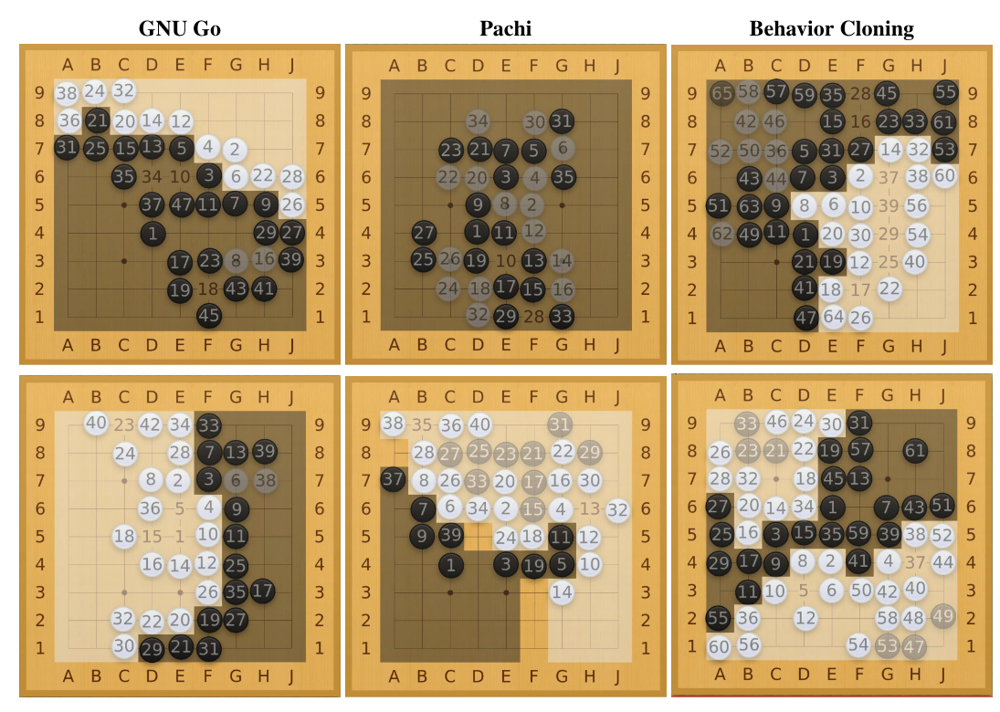

# Learning to Play Go
This repository contains the code of our CSC2515 research project "Learning to Play Go". [📜Report](./2515_report.pdf)

In the project, we implement an agent that learns to play Go on $9*9$ board through behaviour cloning from human knowledge and then refined with self-play. 
Our agent convincingly beats all baselines including several famous Go programs: 

**Our model vs baselines**: Top row - our model plays black;  Bottom row - our model plays white




Table of Contents
=================
  * [Install Dependancy](#install-dependancy)
  * [Prepare Data](#prepare-data)
  * [Training](#training)
  * [Run Engine on Command Line](#run-engine-on-command-line)
  * [Run Engine on Sabaki](#run-engine-on-sabaki)

## Install Dependancy
You need to install following packages in order to run the code:
- [PyTorch>=1.3.1](https://pytorch.org/)
- tqdm
- dill
- fire

## Prepare Data

Unzip the sgf data. 
``` python
unzip -q sgf.zip
```

## Training
``` python
python train_behaviour_cloning.py --steps=1280000
```

Several parameters can be specified:

| Parameter        | Default |                                           |
| ---------------- | ------- | ----------------------------------------- |
| data_dir      | "sgf"   | Path to the data directory.               |
| steps         | 400000  | Training steps.                           |
| verbose_step  | 1000    | Print verbose.                            |
| batch_size    | 2048    | Batch size. Recommend to be at least 128. |
| learning_rate | 1e-3    | Learning rate.                            |

## Run Engine on Command Line

With the model that just trained, we can now deploy it with [GTP](https://www.gnu.org/software/gnugo/gnugo_19.html) to play with other Go programes. 

We can start our pre-trained engine by:

```bash
chmod 777 dlgo.py
./dlgo.py --weights weights-name --playouts 1600 --resign-threshold 0.25
```

Several parameters can be specified:

| Parameter          | Default |                                                              |
| ------------------ | ------- | ------------------------------------------------------------ |
| weights          |         | Path to the pre-trained model.                               |
| playouts         | 400     | MCTS playouts,                                               |
| resign-threshold | 0.1     | If the possibility of win is smaller than the specified value, then resign. |

You can interactively play it though GTP, e.g. `genmove black` will generate a move for black. 

## Run Engine on Sabaki

Since the code supported GTP, it can be intergrated with other Go GUI like [Sabaki](https://github.com/SabakiHQ/Sabaki), an elegant Go board and SGF editor. Go engines can be added to Sabaki to play offline. Sabaki then acts as a graphical UI for any Go software that supports [GTP (Go Text Protocol)](https://www.lysator.liu.se/~gunnar/gtp/).

## Self-play training

**Step 1**:  First we need to run selected some game position to run MCTS. It will take about 10 minutes, to dump 100K game positions.

```python
python dump_position_from_datasets.py
```

**Step 2:** Run MCTS on these selected positions, this step is very slow. If you want to run it on distributed, you need to install [horovod](https://github.com/horovod/horovod),

```python
python -m horovod.runner.launch -np 16 python dump_self_play_results.py
```

It takes ~24 hours in a 2 1080ti machines to dump the results.

**Step 3**: Run refinement on the results. This step takes about 4 hours.

```bash
python train_self_play.py
```

## Acknowledgement
This project was originally forked from  [CGLemon/pyDLGO](https://github.com/CGLemon/pyDLGO/) and incorporates codes from the following open-source projects:
* [CGLemon/pyDLGO](https://github.com/CGLemon/pyDLGO/)
  - `mcts.py`: Monte Carlo Tree Search implementation
  - `gtp.py`: Go Text Protocol (GTP) support for playing against other Go programs
* (https://github.com/ymgaq/Pyaq)
  - `board.py`: Go board representation and operations
* [jtauber/sgf](https://github.com/jtauber/sgf)
  - `sgf.py`: Smart Game Format (SGF) parser for reading game records

